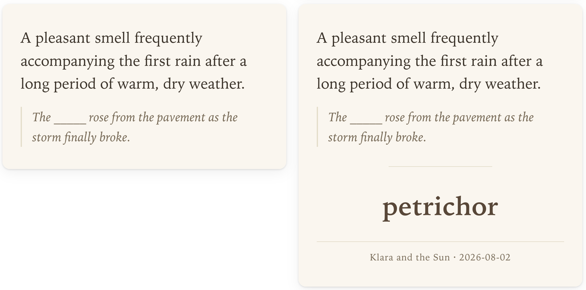

# Kindle Vocabulary → Anki

Turn the words you look up while reading on a Kindle into Anki flashcards — **one card per meaning, not per word.**

Kindle's Vocabulary Builder records every word you tap while reading, along with the sentence it came from. This tool reads those lookups, sends the sentence to Claude, and builds a card for each distinct *sense*: it splits a word's different meanings apart, promotes a tap on `made` into a **make off** card, stores headwords in dictionary form, and merges repeat lookups of the same meaning.

Each card shows you a definition and the real sentence with the answer blanked out; you recall the word. The back fills it back in — the sentence with the answer highlighted, the word, and (optionally) a translation into your native language.



> [!NOTE]
> 🚧🐣 **Heads up - early version!** I built this to scratch my own itch, so right now it does exactly what _I_ needed and nothing more. But I've got a pile of ideas for making it better and more broadly useful - so expect things to grow, and behaviour to shift around. Hope you find it useful! 🤙

## Why this one?

Most Kindle → Anki tools work at the word level: one card per lookup, the lemma on the front, a dictionary entry on the back. Without reading the sentence they can't tell `bank` (river) from `bank` (money), and can't turn a tap on `made` into a **make off** card. Reading the sentence with Claude is the whole point — you get a deck of *meanings in context*, not a word list.

- **Sense-aware.** Polysemy splits into separate cards; phrasal verbs and idioms get promoted to their real headword; headwords are stored in dictionary form; repeat lookups of one sense merge; junk (names, OCR artefacts, foreign words) is dropped.
- **Recall from context.** Every card blanks the answer inside the real sentence it appeared in — tracking the exact span, even for split phrasal verbs (`she _tied_ her hair _up_`).
- **Any language.** Study English, French, German, Spanish, or Japanese out of the box (`--learning`); add more with a data entry, no code. Optionally gloss into your native language (`--translation`).
- **Recognition and production.** `--production` adds a second, active-recall card that prompts in your native language and asks you to produce the target word — born suspended until you've met the word.
- **Safe to re-run.** It only adds what's missing; repeat runs cost nothing for words you already have.
- **Works offline.** `--export deck.apkg` writes a standard Anki package to import by hand — no running Anki required.

## Requirements

| | |
| --- | --- |
| **uv** | `brew install uv` — runs the script and fetches its dependencies automatically |
| **Anki** | running, with the [AnkiConnect](https://ankiweb.net/shared/info/2055492159) add-on on `127.0.0.1:8765` — *or* use `--export` and skip Anki entirely ([Offline export](#offline-export)) |
| **Anthropic API key** | in `.env` as `ANTHROPIC_API_KEY=...` (only needed for `--apply`) |
| **Kindle** | with **Vocabulary Builder** on, connected by USB and mounted at `/Volumes/Kindle` at least once |

## Setup

Once, in order:

1. **Install uv** — `brew install uv`. Nothing else to install; the script declares its own dependencies.
2. **Start Anki with AnkiConnect** — install add-on `2055492159` (Tools → Add-ons → Get Add-ons), restart Anki, leave it running. It's queried even on dry runs.
3. **Add your API key** — create `.env` here with `ANTHROPIC_API_KEY=sk-ant-...`. Optionally add `TRANSLATION_LANGUAGE=Polish` and `LEARNING_LANGUAGE=fr` as defaults.
4. **Connect the Kindle** by USB and confirm it mounts at `/Volumes/Kindle`. The first run caches `vocab.db` into this directory, so later runs work with the Kindle unplugged. (Or point `--db PATH` at a copy.)

## Quick start

```sh
# 1. Dry run — see what would be imported. No Claude calls, nothing written.
uv run kindle_anki.py

# 2. Try a handful of real cards first.
uv run kindle_anki.py --apply --limit 10

# 3. Import the rest.
uv run kindle_anki.py --apply
```

The dry run is the default on purpose: it costs nothing on the Claude side and prints the per-book breakdown before you commit. (It still queries Anki to see what's already handled, so Anki must be running.)

## Common recipes

```sh
# Study French, monolingual
uv run kindle_anki.py --learning fr --apply

# Study French with a Polish gloss on the back
uv run kindle_anki.py --learning fr --translation Polish --apply

# Beginner deck: prompt with the native word instead of a definition
uv run kindle_anki.py --learning fr --translation Polish --layout translation --apply

# Add active-production cards, non-target words pinned to B1
uv run kindle_anki.py --learning fr --translation Polish --production --level B1 --apply

# Only import from specific books
uv run kindle_anki.py --book "1984" --book "Zebras" --apply

# Offline: write a package to import by hand
uv run kindle_anki.py --export deck.apkg --apply
```

## Options

| Flag | Effect |
| --- | --- |
| *(none)* | Dry run: prints the breakdown and sample cards. No Claude calls, no writes. |
| `--apply` | Cluster with Claude and write notes to Anki. |
| `--limit N` | Process at most N new lookups this run. Use it to sample cost and quality. |
| `--book SUB` | Only lookups from books whose title contains `SUB` (case-insensitive). Repeatable. |
| `--learning CODE` | Language you're studying, e.g. `fr`. Default `en`; falls back to `LEARNING_LANGUAGE` in `.env`. See [Languages](#languages). |
| `--translation NAME` | Add a native-language gloss on the back, e.g. `Polish`. Default off; falls back to `TRANSLATION_LANGUAGE`. |
| `--layout NAME` | `definition` (default) prompts with the definition; `translation` prompts with the native word (requires `--translation`). See [Card layout](#card-layout). |
| `--production` | Also build active-production cards. Requires `--translation` and `--level`. See [Production cards](#production-cards). |
| `--level CEFR` | CEFR level (`A1`–`C2`) that non-target words in production sentences are pinned to. Falls back to `level:` in `languages.yaml`. |
| `--promote-after WHEN` | When a production card unsuspends: `seen`, `graduated` (default), or `mature`. Live mode only. |
| `--export FILE.apkg` | Offline mode: write cards to a package, state in `deck_state.json`. See [Offline export](#offline-export). |
| `--force-lang` | Read `--book`'s lookups as your `--learning` language, ignoring Kindle's stored tag. Requires `--book`. See [Mislabeled books](#mislabeled-books). |
| `--reset` | Delete every note in the deck and clear `skipped.json`, then reimport from scratch. Only deletes with `--apply`. |
| `--db PATH` | Read a specific `vocab.db` instead of auto-detecting. |
| `--model ID` | Claude model (default `claude-sonnet-5`). |
| `--batch-size N` | Stem-groups per API request (default 40). |

---

## Languages

Two independent axes control language:

- **`--learning CODE`** — the language you're **studying**. Gates which Kindle lookups are read, sets the language definitions are written in, and picks the headword and blanking rules. Default `en`. Each learning language gets its own deck (`English::Kindle`, `French::Kindle`, …).
- **`--translation NAME`** — your **native** language, glossed on the **back** only. Optional, off by default.

They compose freely: `--learning fr --translation Polish` makes French cards (French headword, definition, and blanked sentence) with a Polish gloss on the back. The gloss sits on the back so recall stays recall, not translation — on the front it would just be a second puzzle. Beginners can flip it with `--layout translation`.

### Adding or tuning a language

Languages are **data, not code** — they live in [`languages.yaml`](languages.yaml), keyed by their Kindle `WORDS.lang` code. `en`, `fr`, `de`, `es`, and `ja` ship. Adding one is a new entry:

```yaml
nl: # the WORDS.lang code (also the SQL gate)
  name: Dutch # spliced into the prompt and the deck ("Dutch::Kindle")
  boundaries: true # blanking: match on word boundaries (\b…\b)
  ignore_case: true # blanking: match case-insensitively
  inflection: true # blanking: fall back to the inflected word/stem
  morphology: >- # prompt fragment: how to normalize a headword
    verbs to the infinitive; nouns singular; promote expressions to the whole.
```

Spaced, cased, suffix-inflecting languages (English, French, …) set the three booleans `true`. Scripts with no word breaks or case (Japanese, Chinese, Thai) set them `false`, so blanking matches the exact span as a plain substring. The file is validated on load; a bad entry stops the run with a message naming the culprit.

### Mislabeled books

`--learning fr` reads only lookups Kindle tagged `fr` — and Kindle takes that tag from the **ebook's metadata, not the dictionary you used.** Some ebooks are mislabeled: a French title shipped tagged `en` puts every lookup under `en`, so `--learning fr` finds nothing and the run fails with `No French lookups found`.

`--force-lang` reads a named book's lookups as your `--learning` language regardless of the tag:

```sh
uv run kindle_anki.py --learning fr --book "Petit Prince" --force-lang --apply
```

It **requires `--book`** — without a scope it would relabel your entire lookup history under one language. Run a separate pass for each mislabeled book.

## Card layout

Every card holds the same fields; the layout only decides which one prompts the front. Pick it with `--layout`:

- **`definition`** (default) — front: the learning-language definition + blanked sentence. Back: the full sentence with the answer filled in and highlighted, the word, and the translation if set.
- **`translation`** — front: your **native** translation + blanked sentence. Back: the full sentence, the word, and the definition. For beginners who can't yet read a definition in the target language. **Requires `--translation`.**

**Re-laying-out an existing deck.** A normal run never touches your templates, so hand-edits in Anki survive every import. Passing an explicit `--layout` (with `--apply`) re-pushes that layout's templates and CSS onto the note type in place — every card re-renders in the new layout, with all cards, scheduling, and review history intact.

```sh
# switch an existing deck to the translation layout, history intact
uv run kindle_anki.py --translation Polish --layout translation --apply
```

For an `.apkg`, the model is rebuilt on every export anyway — just re-export with the new `--layout` and re-import.

### Previewing templates in a browser

```sh
python3 preview_cards.py   # writes card_preview.html and opens it
```

`preview_cards.py` reads the **real** CSS and templates from `kindle_anki.py` and fills them with sample words using the same field substitution Anki does — so what you see is what Anki renders. It shows both layouts (including edge cases like no sentence or no translation), the production card, and a dark-mode toggle. Edit the templates, re-run, refresh.

## Production cards

The default card is **receptive**: you see a definition and recall the word. `--production` adds a second, **active** card to the same note — the mirror direction. It shows a sentence in your **native** language with one word bolded and asks you to produce the equivalent in the language you're learning:

```sh
uv run kindle_anki.py --learning fr --translation Polish --production --level B1 --apply
```

`--production` **requires `--translation`** (the front is in your native language) and a **CEFR `--level`**. The level is the difficulty dial: every word in the native sentence *except* the target is pinned at or below it, so only the target is hard.

- **Three prompts, one per day.** Each note gets three native → target sentence pairs; the card shows one per calendar day, rotated by an inline script that front and back compute identically — no stored state, and a daily word still varies.
- **A first-letter hint keeps you honest.** A prompt is answerable with a synonym, which defeats the point. The front shows the target's first letter, the rest masked, and the letter count — e.g. `c _ _ _ _ _ · 6 letters`. It's computed in JS from the word itself, so it needs no field and appears on every production card, even old ones.
- **Cards unlock themselves.** Being asked to *produce* a word you've just met is discouraging, so production cards are **born suspended** in a `…::Kindle::Production` subdeck. A card unsuspends once its recognition sibling reaches the `--promote-after` threshold:

  | `--promote-after` | Unlocks once the recognition sibling… |
  | --- | --- |
  | `seen` | has been reviewed at least once |
  | `graduated` | has left learning for the review queue **(default)** |
  | `mature` | is in review with interval ≥ 21 days |

- **Promotion is folded into a normal run** — no separate command. Any live `--production --apply` reconciles the whole deck (moves new cards into the subdeck, suspends the not-ready, unsuspends the ready). It's idempotent and never touches a production card you've already started reviewing.
- **Back catalogue is backfilled.** Cards built before you turned on `--production` get pairs generated from their existing word, definition, and sentence. This runs even with no new lookups to import, respects `--limit`, and is resumable.
- **Offline caveat.** `--export` can *build* production cards but can't suspend, move, or promote them — that's live-only. Run a live `--production --apply` once after importing to reconcile.

## Offline export

Don't want to run Anki, or want to study on a phone with no desktop Anki? Pass `--export deck.apkg` and the tool writes a standard Anki package to import by hand (**File → Import**):

```sh
uv run kindle_anki.py --export deck.apkg          # dry run, offline
uv run kindle_anki.py --export deck.apkg --apply  # cluster and write the package
```

Everything sense-aware works identically — only where state lives changes. With no running deck to query, **`deck_state.json`** becomes the source of truth: it records every card and the lookup ids it consumed, so re-runs still skip, split, and promote exactly as before. The `.apkg` is a **cumulative snapshot** — each card carries a stable GUID, so re-importing a regenerated package updates cards in place instead of duplicating them.

> [!NOTE]
> Offline mode can't self-heal on manual edits: if you delete a card *in Anki*, `deck_state.json` doesn't know, so that lookup won't come back. Edit `deck_state.json` (or `--reset`) to force a rebuild.

## State and re-runs

The script is safe to run repeatedly — it only ever adds what's missing.

**The hidden `Lookups` field on each card is the source of truth.** Every processed lookup id is recorded on the card it produced or was absorbed by, so re-runs cost nothing for words you already have. This also makes the pipeline **self-healing**: delete or edit a card in Anki and its lookup ids leave the consumed set, so they're reprocessed next run.

That self-heal is the catch for **a card you want gone** (say a misclick you already know): deleting it won't stick — it comes back next run. **Suspend the note instead.** Dedup is content-based and ignores suspended state, so a suspended card keeps claiming its lookup id, stays out of reviews, and never regenerates.

**`skipped.json`** (git-ignored) holds junk only, keyed by `LOOKUPS.id` → reason, so junk isn't re-judged every run:

```json
{ "a1b2c3": "proper noun", "d4e5f6": "ocr artefact" }
```

It's rewritten after every batch, so an interrupted run resumes cleanly. `--reset` clears it (and the deck) for a full rebuild.

## How it works

```
Kindle vocab.db ──copy──▶ ./vocab.db ──▶ every lookup in the learning lang (with its id)
                                              │
                        book filter ──────────┤
                                              ▼
                 query Anki by Stem ──▶ consumed ids + existing cards
                                              │
              drop consumed + skipped ────────┤
                                              ▼
                            stem-groups (batches of 40) ──▶ Claude
                                              │  new / existing / junk
                                              ▼
                            AnkiConnect ──▶ <Language>::Kindle
```

1. **Copy the database.** `vocab.db` is copied off the Kindle before anything reads it (SQLite on a removable FAT volume shouldn't be opened in place). The copy doubles as a cache.
2. **Read every lookup.** Each `LOOKUPS` row becomes a `Lookup` carrying its id, lemma, surface form, sentence, book, and timestamp. Nothing is collapsed, so Claude can see the different senses.
3. **Work out what's new — before spending money.** The deck is queried by `Stem`. From that one pull the tool builds the **consumed** lookup ids (union of every card's `Lookups`) and the **existing** cards per stem. A lookup is *new* only if it's neither consumed nor in `skipped.json`.
4. **Cluster.** New lookups are grouped by stem and sent to Claude in batches. For each group Claude returns new cards (headword, definition, span(s) to blank, optional translation) plus a verdict per lookup: **new**, **existing** (same sense as a deck card), or **junk**. Structured outputs pin the schema; the system prompt is cached.
5. **Write.** One note per new card. `existing` verdicts append the lookup id to the matched card; `junk` goes to `skipped.json`. Offline, the same outcomes go to `deck_state.json` and the `.apkg`.

**On a dropped connection.** Read-only AnkiConnect calls are retried with backoff (re-asking is safe). Mutating calls (`addNotes`, …) are **not** retried — a reset could arrive after Anki already applied the change, double-adding a note. They fail fast; `skipped.json` is saved after every batch, so re-running resumes cleanly.

### What gets created in Anki

- **Deck** `<Language>::Kindle`, named for the learning language.
- **Note type** `Kindle Vocab` with fields `Stem`, `Word`, `Translation`, `Definition`, `Sentence`, `SentenceFull`, `Source`, `LookupDate`, `Lookups`, and (for production) three `ProdNative`/`ProdTarget` pairs. It carries a **Recognition** template and, gated on production data, a **Production** one. Empty fields are hidden by the templates.
- **Tags** `kindle` plus `book::<slug>` (e.g. `book::why-zebras-don-t-get-ulcers`), giving a per-book tag tree.

`Stem` and `Lookups` are hidden bookkeeping fields. Missing fields and templates are added to a pre-existing note type automatically on the next `--apply`, and `SentenceFull` is backfilled on old cards by re-reading the source sentence from `vocab.db`.

**Blanking.** Claude returns the exact surface span(s) to hide — a **list**, so a `make off` card blanks the whole expression, and a split phrasal verb gives each piece separately (`["tied", "up"]`) so the object between them stays visible. Each piece is matched verbatim; if one doesn't occur the tool falls back to the inflected form, then the lemma, and if nothing matches it leaves the sentence intact rather than mangle it.

## Troubleshooting

**`Cannot reach AnkiConnect at http://127.0.0.1:8765`** — Anki isn't running or AnkiConnect isn't installed. Anki must stay open for the whole run, including dry runs.

**`No vocab.db found`** — Plug the Kindle in and confirm it mounts at `/Volumes/Kindle`, or pass `--db PATH`. If it prints `Kindle not mounted; using cached copy` and then finds no lookups, it fell back to a stale local `vocab.db`.

**`No <language> lookups found`** — The lookups exist but Kindle tagged them with a different `WORDS.lang` — usually a mislabeled ebook. Read them with `--book "<title>" --force-lang`. See [Mislabeled books](#mislabeled-books).

**`ANTHROPIC_API_KEY is not set`** — Add it to `.env` as `ANTHROPIC_API_KEY=sk-ant-...`.

**A card came out wrong** — Delete it in Anki; its lookup ids get reprocessed next `--apply`. To rebuild the whole deck, use `--reset`.

## Tests

```sh
# fast, free, offline — pure logic + mocked Anki + real sqlite/tmp files
# (add --with genanki to also exercise the real .apkg write)
uv run --with pytest --with genanki pytest

# behavioral evals against the real API (cheap model), opt-in — costs money
uv run --with pytest --with anthropic pytest -m llm
```

The evals use `claude-haiku-4-5` and assert loose properties that survive model nondeterminism while catching prompt/schema regressions: a proper noun is junk, two senses split into two cards with verbatim spans, a different sense of an existing word becomes a new card, an inflected verb comes back as the infinitive, and a phrasal verb is promoted to its expression headword.

## Files

| | |
| --- | --- |
| `kindle_anki.py` | the whole tool — one file, PEP 723 inline dependencies |
| `languages.yaml` | learning-language profiles (name, blanking flags, morphology) |
| `preview_cards.py` | render the card templates to `card_preview.html` |
| `tests/` | pytest suite (`-m llm` for the API evals) |
| `.env` | `ANTHROPIC_API_KEY` plus optional `TRANSLATION_LANGUAGE` / `LEARNING_LANGUAGE` (git-ignored, mode 600) |
| `vocab.db` | cached copy of the Kindle database (git-ignored) |
| `skipped.json` | junk lookup ids → reason (git-ignored) |
| `deck_state.json` | offline deck state for `--export` (git-ignored) |

## A note on backups

Anki keeps automatic backups in `~/Library/Application Support/Anki2/<profile>/backups/` and logs deleted notes to `deleted.txt` there. If an import goes wrong — especially after `--reset` — restore with **File → Import** on the newest `.colpkg` from before the mistake.
